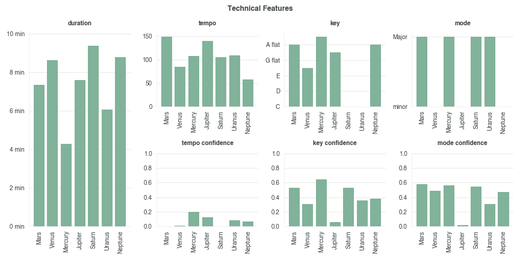
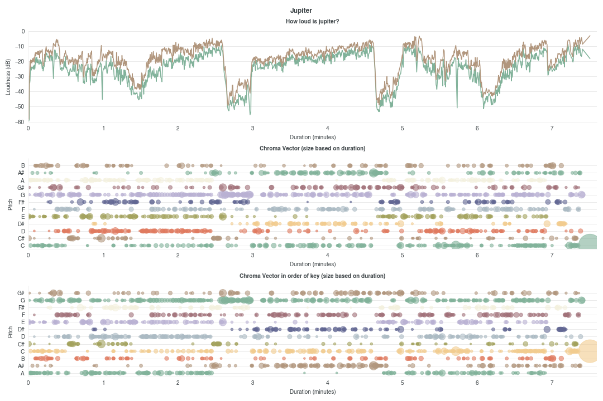

# gustav-holst
🎼 🎶 🪐

[See my final product!](https://ifcolorful.com/gustav-holst)

Check out the symphony The Planets by Gustav Holst on [Spotify](https://open.spotify.com/album/4v0Xyz0LVToUsSTGdsvKSK?si=Cz-2yavOQ-OZASBjfu9ZTw).

## Instructions

### Set up a Web Server

If your browser (e.g. Chrome) prevents you from loading local files via Javascript, run the following command in your terminal.

```
python -m http.server 8000 &
```

Then navigate to [http://localhost:8000/](http://localhost:8000/).

## Data Analysis

See my gathering process and discovery [here](https://github.com/sarinac/gustav-holst/blob/main/data/exploratory.ipynb).

**Technical Features:** Spotify provides data on each of the 7 movements. `Duration` is most reliable metric. Because the pieces have dynamic musical phrases like changing tempo or key, the other metrics are not so useful on the track level.



**Analysis:** Spotify's Audio Analysis shows where in the movement gets relatively louder and where different pitches are more prominent. By taking the first `key` on the section level, the third chart reorders the y-axis such that the tonic (a minor in Jupiter) appears on the bottom. Halfway through the piece, a key change to E-flat is shown in the visual.


